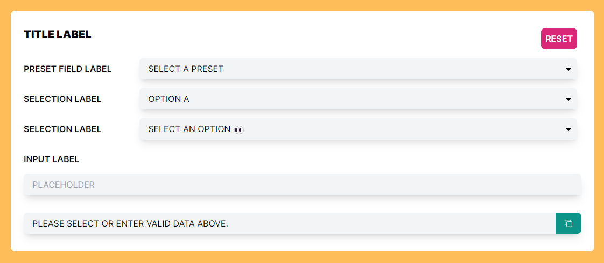
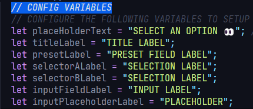

# iGEM-dna-calculator

#### Prototype for a DNA calculator to be used in an iGEM website.

 

# ⚒️SETUP INSTRUCTIONS
The project has been configured to allow for easy setup and integration. The following are key files that you must
configure to setup the calculator:
<ol>
  <li><b>App.js</b>: You can configure most of the app from this file. Edit the variables at the top of the file to
    setup all the labels and placeholder texts. [See Image Below]</li>
  
  <li><b>presets-data-set.json</b>: Located within the <b>data</b> folder, this JSON file is used to generate the
    options for the presets selector component. Edit this file using the pre-existing format within the document to
    alter the options for presets selector. <b style="color: red;">It is important to follow the pre-existing format for
      the options to properly generate.</b></li>
  <li><b>data-set-a.json</b>: Located within the <b>data</b> folder, this JSON file is used to generate the options for
    the selector A component. Edit this file using the pre-existing format within the document to alter the options for
    selector A. <b style="color: red;">It is important to follow the pre-existing format for the options to properly
      generate.</b></li>
  <li><b>data-set-a.json</b>: Located within the <b>data</b> folder, this JSON file is used to generate the options for
    the selector B component. Edit this file using the pre-existing format within the document to alter the options for
    selector B. <b style="color: red;">It is important to follow the pre-existing format for the options to properly
      generate.</b></li>
</ol>

 

# 🖥️Technologies
Here are the technologies used:
<ul style="list-style: square;">
  <a href="https://react.dev/" target="_blank" style="text-decoration: none;">
    <li>React</li>
  </a>
  <a href="https://tailwindcss.com/" target="_blank" style="text-decoration: none;">
    <li>Tailwind CSS</li>
  </a>
  <a href="https://www.npmjs.com/package/react-icons" target="_blank" style="text-decoration: none;">
    <li>React-Icons</li>
  </a>
  <a href="https://www.npmjs.com/package/react-toastify" target="_blank" style="text-decoration: none;">
    <li>React-Toastify</li>
  </a>
</ul>

 

# 🧩COMPONENTS
Here is the description of the components you will find within this app:
<ul style="list-style: square;">
  <li><b>SelectorMenu</b>: This is the selection menu component. Key attributes for this component are <b>dataset</b>,
    <b>value</b>, and <b>selectedOption</b>. <b>dataset</b> takes in an array of objects used to generate the options
    for the selection menu. Each object in this array must include an id (int) and value (string) fields.
  </li>
  <li><b>PresetSelector</b>: This is the preset selector menu component. Key attributes for this component are
    <b>dataset</b>, <b>value</b>, and <b>selectedPreset</b>. <b>dataset</b> takes in an array of objects used to
    generate the options for the selection menu. Each object in this array must include an id (int), value (string), and
    preset (int array -> [#, #]) field.
  </li>
</ul>