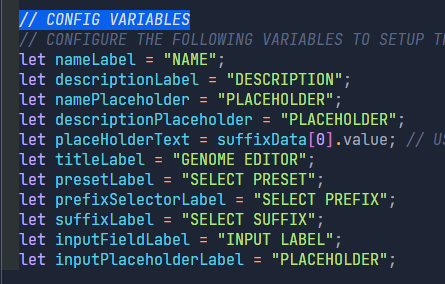

# iGEM-dna-calculator

#### Prototype for a DNA calculator to be used in an iGEM website.


<br>

# 🖥️Technologies

Here are the technologies used:

<ul style="list-style: square;">
  <a href="https://react.dev/" target="_blank" style="text-decoration: none;">
    <li>React</li>
  </a>
  <a href="https://tailwindcss.com/" target="_blank" style="text-decoration: none;">
    <li>Tailwind CSS</li>
  </a>
  <a href="https://www.npmjs.com/package/react-icons" target="_blank" style="text-decoration: none;">
    <li>React-Icons</li>
  </a>
  <a href="https://www.npmjs.com/package/react-toastify" target="_blank" style="text-decoration: none;">
    <li>React-Toastify</li>
  </a>
  <a href="https://www.npmjs.com/package/bio-parsers" target="_blank" style="text-decoration: none;">
    <li>Bio-Parsers</li>
  </a>
  <a href="https://www.npmjs.com/package/framer-motion" target="_blank" style="text-decoration: none;">
    <li>Framer Motion</li>
  </a>
  <a href="https://www.npmjs.com/package/usehooks-ts" target="_blank" style="text-decoration: none;">
    <li>Usehooks-TS</li>
  </a>
</ul>

<br>

## 🪶KEY FEATURES

- **Persistent Storage**: Accidentally close your browser? Don't worry, your data will be right where you left it. The app will automatically store your data in your browser untill you decide to clear it.
- **Input Validation**: Don't worry about writing invalid inputs. The editor will highlight any invalid characters in your input and will offer to automatically remove them for you!
- **Modify & Delete Existing Data**
- **Export your Data**: Done creating? Well you can now export your data to file types like FASTA or GenBank.

<br>

# 🧩 FILE STRUCTURE

Here is the visual of the file structure for the project:

```bash
│   GeneEditor.jsx
│   index.css
│   index.js
│
├───components
│       GenomeCard.jsx
│       InputComponent.jsx
│       SelectionComponent.jsx
│       SelectionMenu.jsx
│
└───data
        data-set-A.json
        data-set-B.json
        export-formats.json
        presets-data-set.json
```

Here is a quick overview of each of some the the important files in there:

- **GeneEditor.jsx**: This is your main file. This is where all the various components come together to make the app work.
- **GenomeCard.jsx**: This is the component file for a Genome Card which is displayed in the GenomeBank section.
- **InputComponent.jsx**: This component is the combination of a Label and a selection of either a **Input** Box or **Text Area**.
- **SelectionMenu.jsx**: This component is the combination of a Label and a SelectionComponent. Data in the SelectionComponent can be configured using the provided options.
- **SelectionComponent.jsx**: This component is a helper component for SelectionMenu and holds the custom selection menu.

## ⚒️SETUP INSTRUCTIONS

The project has been configured to allow for easy setup and integration. The following are key files that you can configure:

1. **GeneEditor.jsx**: You can configure most of the app from this file. Edit the variables at the top of the file to change the provided labels and placeholder texts. [See Image Below]
   
2. To configure the options for the various selection fields, edit the .json files located within `src/data/` directory. `data-set-a.json` refers to the prefix options, `data-set-b.json` refers to the suffix options, `presets-data-set.json` refers to the presets options.
